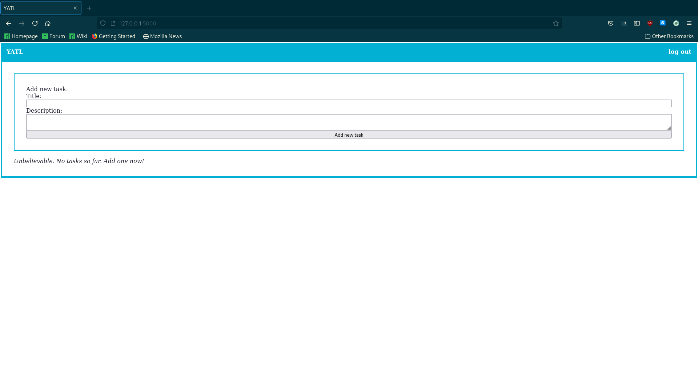
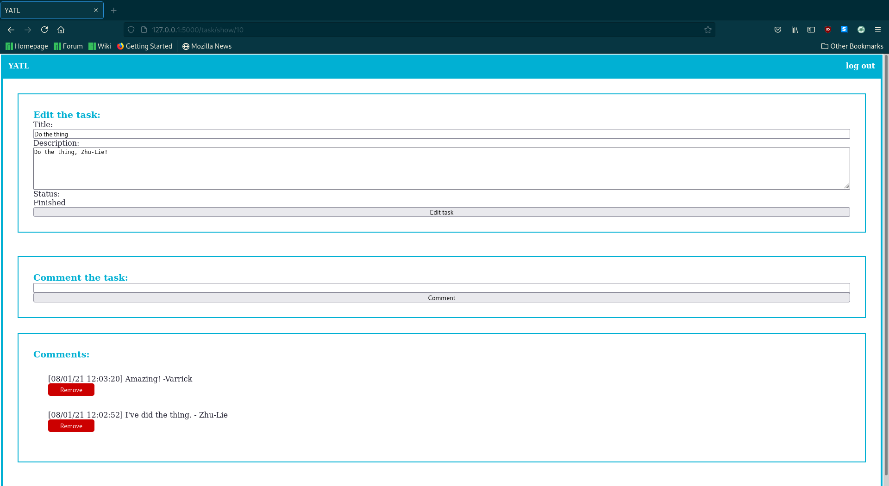

# YATL

Yet Another Todo List - a simple web based TODO list for a small group of
collaborators written in Flask.

## Features
  - Single user with login
  - Web app
  - Tasks can be easily added, removed or marked as in progress or finished
  - Each task can be easily commented - great for adding information about the
    project's progress or to store important resources (websites or some other
    references)
    
## Screenshots





## Configuration

Prepare database:
```
sqlite3 yatl.db < schema.sql
```

Install dependencies with pip:
```
pip install -r requirements.txt
```

Set a password with enviroment variable (optional): 
```
export YATL_PASSWORD="your new password"
```

The default password is `PASSWORD`.

If you want your database somewhere else than in this directory, modify the
following line in the `yatl.py` file:
```
DATABASE = './yatl.db'
```

To run localy, just run: 
```
python src/yatl.py
```

Otherwise, you will need to do couple more steps. To deploy your app on apache
server, follow this [article](https://pythonbasics.org/deploy-flask-app/).
